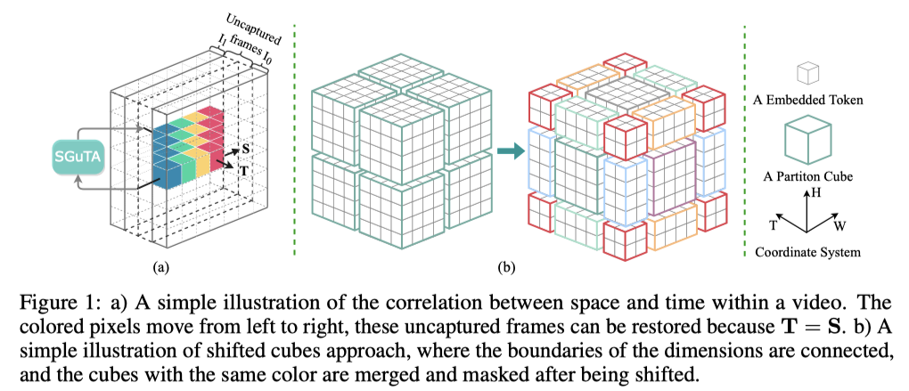
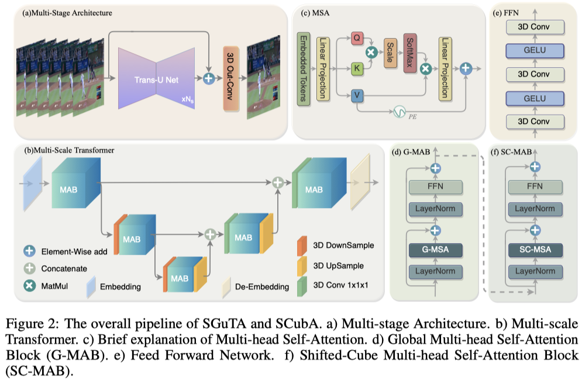

## Polarization video frame interpolation for 3D human pose reconstruction with attention mechanism

Implementation of "[**Polarization video frame interpolation for 3D human pose reconstruction with attention mechanism**](https://www.sciencedirect.com/science/article/abs/pii/S0143816625002325)".
## Dependencies

The following pakages are required to train and test the model.

- Ubuntu 20.04.4 LTS
- Python 3.9.7
- numpy==1.19.2
- PyTorch==1.8.1
- torchvision==0.9.0
- cudatoolkit==11.3
- tqdm
- einops

You can install these Python packages manually or  just run the following command :

```
cd ~/VFI_master/
pip install -r requirements.txt
```

## Proposed Methods

<center></center>

<center></center>

## Train

Our models are trained on 6 Tesla A100 GPUs with `DistributedDataParallel`, Please manually fix the configuration to adapt your device by maintaining the `CUDA_VISIBLE_DEVICES`, `nproc_per_node`, `num_gpu`  consistent:

```bash
cd ~/VFI_master/

CUDA_VISIBLE_DEVICES=0,1,2,3,4,5 python -m torch.distributed.launch --nproc_per_node=6 --master_port=52526 main_train.py\
    --model SCubA \
    --stage 3\
    --batch_size 4 \
    --test_batch_size 8\
    --num_gpu 6\
    --log_iter 120\
```

For example, if you want to train our model on signal GPU, you can modify this command as:

```bash 
cd ~/VFI_master/

CUDA_VISIBLE_DEVICES=0 python -m torch.distributed.launch --nproc_per_node=1 --master_port=52526 main_train.py\
    --model SCubA \
    --stage 3\
    --batch_size 4 \
    --test_batch_size 8\
    --num_gpu 1\
    --log_iter 120\
```

Training **SGuTA** is similar to the above, just change `model` to `SGuTA`.

## Test

After training, you can evaluate the model with following command:

```bash
cd ~/VFI_master/

python test.py --model <model_name> \
	--dataset <dataset_name> \
	--nbr_frame <number_of_input_frames> \
	--data_root <path_dataset> \
	--pretrained <saved_model> \
	--test_batch_size 1 \
```

For example, to test on Vimeo90k testset, run:

```bash
cd ~/VFI_master/

python test.py --model SCubA \ 
	--dataset vimeo90K_septuplet\
  --nbr_frame 6 \
  --data_root '/home/esthen/Datasets/vimeo_septuplet'\
  --pretrained "saved_models_final/vimeo90K_septuplet/ScubA/SCubA_stage_3.pth"\
  --test_batch_size 1\
```

- Testing **SGuTA** is similiar to the above,  just change `model` to `SGuTA`.
- To test our models on Davis or SNU_FILM dataset, change  `dataset` to `Davis_test` or `SNU_FILM`
- You can also evaluate SGuTA and SCubA using our pretrained models, which can be obtained from the following links. We offer weights with differnet stage($N_s$) .

| Stage |                                                        SGuTA                                                        |                                                        SCubA                                                        |
| :---: | :-----------------------------------------------------------------------------------------------------------------: | :-----------------------------------------------------------------------------------------------------------------: |
|   1   |                                                35.65/0.971([Weight]())                                                |      36.72/0.976([Weight](https://drive.google.com/file/d/1PHmflYA3Zr5jo8Xxxq0ab7N7FnamF3yH/view?usp=share_link))      |
|   2   |      37.28/0.979([Weight](https://drive.google.com/file/d/1EhRSp3KwnmDd6hImVCC5Iu1do66HZbgB/view?usp=share_link))      |      37.48/0.980([Weight](https://drive.google.com/file/d/19PzVu_jwMDrcUVNsvGQ9htr2Mi42-99L/view?usp=share_link))      |
|   3   | **37.54/0.980**([Weight](https://drive.google.com/file/d/17365d0gGUSYRPY5209GSyrxxWspmuvHl/view?usp=share_link)) | **38.04/0.981**([Weight](https://drive.google.com/file/d/13-DcpCCJHMsKKcLn0EDJ4-YExmYh7VRj/view?usp=share_link)) |

## Baseline Models

Other SOTA methods in recent years are listed here, including their number of parameters, computational complexity, performance, as well as trained models.

|   Method   | Params | FLOPs | PSNR/SSIM on Vimeo-90k |                                        Trained Model                                        |
| :--------: | :----: | :----: | :--------------------: | :------------------------------------------------------------------------------------------: |
|   SCubA   | 17.30 | 51.71 |      38.04/0.981      | [Weight](https://drive.google.com/file/d/13-DcpCCJHMsKKcLn0EDJ4-YExmYh7VRj/view?usp=share_link) |
|   SGuTA   | 27.60 | 73.55 |      37.54/0.980      | [Weight](https://drive.google.com/file/d/17365d0gGUSYRPY5209GSyrxxWspmuvHl/view?usp=share_link) |
|   VFIT-B   | 29.08 | 85.03 |      36.96/0.978      | [Weight](https://drive.google.com/drive/folders/1M6ec7t59exOSlx_Wp6K9_njBlLH2IPBC?usp=sharing) |
|   VFIT-S   |  7.54  | 40.09 |      36.48/0.976      |       [Weight](https://drive.google.com/drive/folders/1gxQBuZvx-g4pLQfov9kZrqaBJydV_6OY)       |
|   FLAVR   | 42.06 | 133.14 |      36.30/0.975      | [Weight](https://drive.google.com/drive/folders/1M6ec7t59exOSlx_Wp6K9_njBlLH2IPBC?usp=sharing) |
|   AdaCoF   | 21.84 | 24.83 |      35.40/0.971      |  [Weight](https://drive.google.com/file/d/19Y2TDZkSbRgNu-OItvqk3qn5cBWGg1RT/view?usp=sharing)  |
|    QVI    | 29.21 | 72.93 |      35.15/0.971      |  [Weight](https://drive.google.com/file/d/1v2u5diGcvdTLhck8Xwu0baI4zm0JBJhI/view?usp=sharing)  |
| SuperSloMo | 39.61 | 49.81 |      32.90/0.957      |  [Weight](https://drive.google.com/file/d/1dR2at5DQO7w5s2tA5stC95Nmu_ezsPth/view?usp=sharing)  |

## Interpolation for custom video

You can use our pretrained model to interpolate your personal video by simply using the following command:

```
python interpolate.py --model <SGuTA_or_SCubA> --input_video <input_video> --factor 2 --load_model <model_path>
```

## Visual Results

For more **visual results**, please click [here](https://drive.google.com/drive/folders/1hHcqAoNpr2b3sFSEDRm5J4SJo5xHPexh?usp=share_link)!

## Acknowledgement

Many parts of this code is adapted from:

* FLAVR: Flow-Agnostic Video Representations for Fast Frame Interpolation, WACV 2023 (Best Paper Finalist) [Code](https://github.com/tarun005/FLAVR)
* Swin Transformer: Hierarchical Vision Transformer using Shifted Windows, CVPR 2021 [Code](https://github.com/microsoft/Swin-Transformer)

Thans for their great contribution and sharing.
