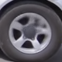
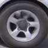
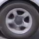
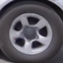
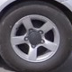
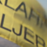
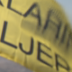

## SGuTA & SCubA for VFI

This page is for paper **Spatially-Guided Temporal Attention (SGuTA) and Shifted-Cube Attention (SCubA) for Video Frame Interpolation**

#### Coming soon, the source code will be uploaded once the paper is accepted!

### Preview

| Overlayed                                                    | FLAVR                                                        | VFIT-S                                                       | VFIT-B                                                       | SGuTA                                                        | SCubA                                                        | GT                                                           |
| ------------------------------------------------------------ | ------------------------------------------------------------ | ------------------------------------------------------------ | ------------------------------------------------------------ | ------------------------------------------------------------ | ------------------------------------------------------------ | ------------------------------------------------------------ |
|  |  |  |  |  |  |       |
|  |  |  |  |  |  |        |
|  |  |  |  |  |  |  |

